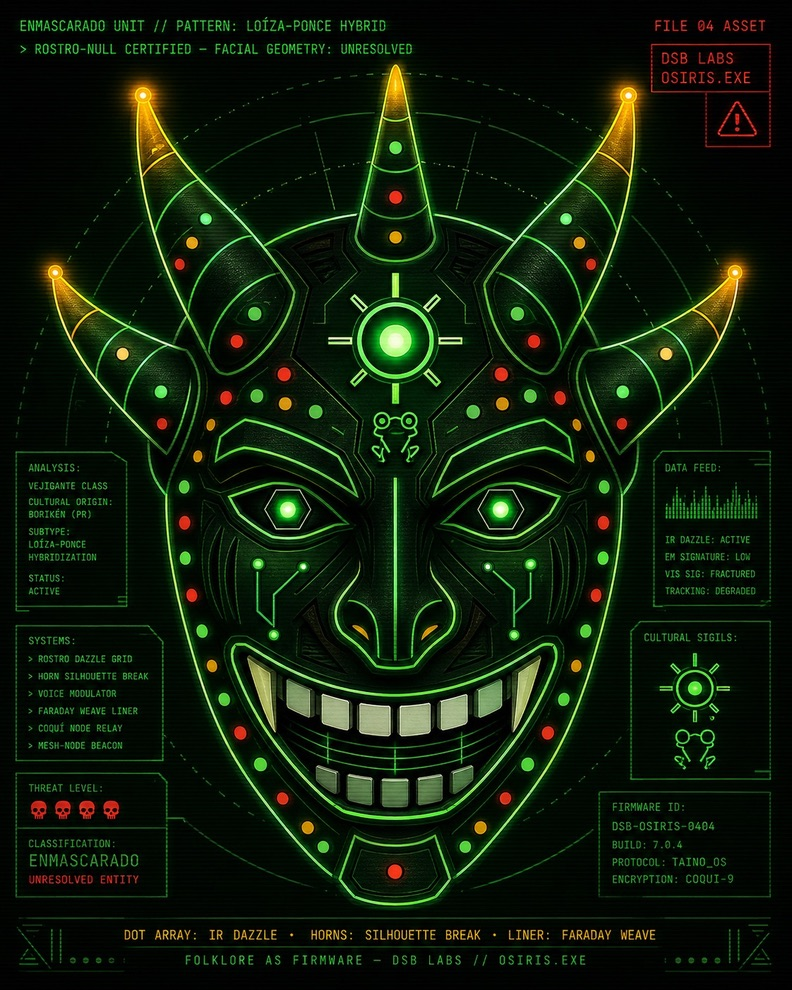

<p align="center">
  
</p>

<h1 align="center">OSIRIS.EXE</h1>

<p align="center"><em>Folklore as firmware. The archive never died — it remembered.</em></p>

---

The operating system of the OSIRIS.EXE universe — an ancient archive that survived
attempts to erase it. You don't browse it; you are granted permission to
**recover memory**. A sacred green-phosphor CRT experience: a boot rite, an
interactive terminal, and recovered fragments that play like memories surfacing.

## Live

- **Play it live:** https://kingpiragua.github.io/osiris-exe/
- **Repository:** https://github.com/kingpiragua/osiris-exe
- **Run locally:** `npm run dev` → <http://localhost:3000>

Every push to `main` is built as a static export and deployed to GitHub Pages
by [`.github/workflows/deploy.yml`](.github/workflows/deploy.yml).

## The experience

```
boot rite → terminal → begin (recover) or archive (browse)
          → recovered fragments → Esc back to the archive
```

Terminal commands: `help`, `begin`, `archive`, `clear`.

## Recovered fragments

| # | Title | Role |
|---|-------|------|
| 001 | THE ARCHIVE | place |
| 002 | SIGNAL | signal |
| 003 | THE FIRST EYE | presence |
| 004 | THE NAME IN THE MACHINE | identity |
| 005 | BEFORE THE WIRE | history |

Browse them in-world at `/archive`, or recover the first via the terminal's
`begin`.

## Run locally

```bash
npm install
npm run dev        # http://localhost:3000
npm run build      # production build
npm run lint
```

> Tip: click or press a key on first load so the CRT hum can start (browser
> autoplay needs one interaction). Type `reset` at the prompt to replay the boot.

## How it works

- **Next.js (App Router) + TypeScript + Tailwind.** No backend.
- **Config-driven Archive Engine** — each fragment declares its playback via a
  `memory.effects` config (boot sequence, corruption, eye/root/organic fields,
  final reveal…). Adding a fragment is a single data file in
  `src/content/memories/`, rendered by `/archive/[id]` — no new components.
- **Procedural CRT sound** (Web Audio, no assets): hum → silence → phosphor flick.
- **Restraint as design:** black, phosphor green (#7DFFB0), scanlines, the DISK
  signature, and the slow ritual of recovery.

## Documentation

- [`docs/OSIRIS_VISION.md`](docs/OSIRIS_VISION.md) — design intent
- [`docs/MASTER_BLUEPRINT/`](docs/MASTER_BLUEPRINT/) — the franchise blueprint

## Deploy

This is a standard Next.js app and deploys cleanly to
[Vercel](https://vercel.com/new). Once deployed, replace the **Live** link above
with the deployment URL.

---

© Disk Darián (kingpiragua). All rights reserved.
